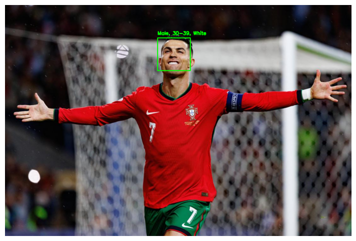

# Gender, Age, and Race Classification

## Project Overview
This project focuses on developing and evaluating a multi-tasking deep learning model for classifying gender, age, and race from facial images. The model was trained on the [FairFace dataset](https://www.kaggle.com/datasets/aibloy/fairface) and achieved the following performance:
- **Gender Classification**: High accuracy of **94%**.
- **Age Classification**: Moderate accuracy of **55%**, indicating challenges in distinguishing certain age groups.
- **Race Classification**: Accuracy of **71%**, with some misclassifications due to dataset biases.

## Model Development
### Training Process
Initially, multiple models were tested, including:
- A **self-created model**.
- **ResNet18**.
- **EfficientNetB0**.

The best-performing model was then trained on the entire dataset with improvements such as:
- **Dropout layers** to reduce overfitting.
- **Data augmentation** to enhance generalization.

## Model Evaluation
The trained model was evaluated using standard classification metrics:
- **Accuracy**: Overall correctness of predictions.
- **Precision, Recall, F1-score**: Detailed classification performance.
- **Confusion Matrix**: Visualization of misclassification patterns.
- **Grad-CAM**: Used for interpretability and understanding feature importance.

## Sample Output

## Key Takeaways
- **Gender classification** performs well with high accuracy.
- **Age classification** is challenging due to overlapping facial features between age groups.
- **Race classification** shows moderate performance but may be influenced by dataset biases.
- **Visualization and probability analysis** provided insights into model confidence and error patterns.

## Next Steps
- **Improve Dataset**: Enhance dataset diversity and add more samples.
- **Optimize Model Performance**: Experiment with different architectures, hyperparameters, and fine-tuning strategies.
- **Ensemble Learning**: Combine multiple models to improve overall classification accuracy and robustness.